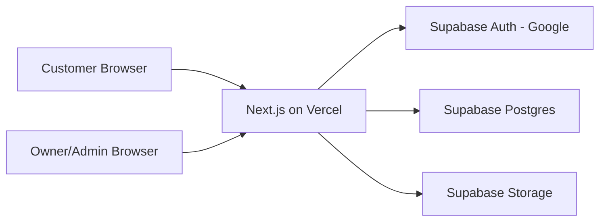

# PUCYCLES Tech Stack Plan

## Recommendation

Use a simple hosted stack:

- Frontend/backend: Next.js
- Hosting: Vercel
- Database/auth/storage option A: Supabase
- Image CDN option A: Supabase Storage for simplicity
- Image CDN option B: Cloudinary if product images need better optimization later
- Email/notification: leave manual in V1
- Payment: manual proof upload only in V1

Recommended V1 choice:

- Next.js + Supabase + Vercel

This is the best fit for a small ecommerce MVP with one admin, around 100 products, Google login, order workflow, stock reservation, payment proof uploads, and international shipping quote handling.

## Why Not Firebase First

Firebase is also good, especially for Google login and quick prototypes. However, PUCYCLES has ecommerce data that is relational:

- products
- product images
- categories
- brands
- compatible vehicle models
- orders
- order items
- payment proofs
- shipping quote
- exchange rates

Supabase/Postgres is easier to reason about for this kind of data. It also makes admin filters, reporting, and future migration cleaner.

## Stack Details

### App Framework

Use Next.js with TypeScript.

Reasons:

- One codebase for storefront and admin
- Server-side routes for checkout and admin actions
- Works well on Vercel
- Easy to make responsive UI
- Easy to add SEO/product pages later

### UI

Use Tailwind CSS and shadcn/ui-style components.

Reasons:

- Fast to build
- Clean minimal design
- Good mobile responsiveness
- Easy to keep PUCYCLES style: white, deep red, black, light gray

### Database

Use Supabase Postgres.

Reasons:

- Product/category/brand/model/order data fits relational DB well
- Easier joins and admin filtering
- Easier stock reservation transaction logic
- Easier future reporting

### Auth

Use Supabase Auth with Google provider.

Rules:

- Customer login: Google only
- Admin login: owner's Google email only
- Role stored in users table
- Admin route protected by email/role check

### File Storage

V1 recommended:

- Supabase Storage for product images and payment proof images

Reason:

- Keeps database, auth, and storage in one service
- Enough for low traffic and around 100 products

Future option:

- Move product images to Cloudinary if image transformations/CDN optimization become important

### Hosting

Use Vercel.

V1:

- Start on Hobby/free if usage and commercial terms fit the account/project situation

Upgrade trigger:

- Move to Pro when the shop needs production comfort, higher limits, team workflow, or stronger spend controls

### Domain

Buy a domain separately and connect to Vercel.

Possible domain names:

- pucycles.com
- pucycles.co
- pucyclesparts.com
- pucyclescustom.com

Need availability check before buying.

## Architecture

## Key Technical Rules

### Stock Reservation

- Store stock_quantity and reserved_quantity.
- Available stock = stock_quantity - reserved_quantity.
- On checkout, reserve stock in a transaction.
- On cancellation before payment, release reserved stock.
- Once payment proof is submitted, customer cannot cancel directly.
- Admin can cancel and release stock manually.

### Currency

- Store all product prices in THB.
- Store exchange rates in database.
- Display converted price by selected country/currency.
- Save exchange rate snapshot on order creation.
- Do not recalculate old orders when exchange rates change.

### International Shipping

- Do not automate V1.
- Admin checks shipping manually using weight and destination country.
- Admin enters shipping fee in THB.
- Customer sees converted final total.

### Payment Proof

- Customer uploads one receipt/proof image per order.
- Supported image types: jpg, jpeg, png, webp.
- Suggested file size limit: 5 MB.
- Admin reviews manually.

### Product Images

- Maximum 5 images per product.
- Store image order.
- First image is cover image.

## Suggested App Routes

### Customer

- /login
- /setup
- /products
- /products/[slug]
- /cart
- /checkout
- /orders
- /orders/[orderNumber]

### Admin

- /admin
- /admin/orders
- /admin/orders/[orderNumber]
- /admin/products
- /admin/products/new
- /admin/products/[id]/edit
- /admin/settings

## Recommended Database Tables

- users
- products
- product_images
- categories
- brands
- vehicle_models
- product_vehicle_fitments
- carts
- cart_items
- orders
- order_items
- payment_proofs
- exchange_rates
- settings

## Estimated Running Cost

At about 25 visitors/day and around 100 products:

- Vercel: likely 0 THB/month at MVP stage
- Supabase: likely 0 THB/month at MVP stage
- Domain: around 400-700 THB/year, depending on registrar and domain
- Optional upgrade later: Vercel Pro around 20 USD/month, Supabase Pro around 25 USD/month

Important: pricing and free-tier rules can change. Check the official pricing pages before subscribing.

## Implementation Order

1. Create Next.js app
2. Set up Supabase project
3. Configure Google login
4. Create database schema
5. Build customer product browsing
6. Build cart and checkout
7. Build stock reservation
8. Build proof upload
9. Build admin product management
10. Build admin order management
11. Add exchange rate settings
12. Add shipping quote workflow
13. Test mobile and desktop
14. Deploy to Vercel

## Decision

Use:

- Next.js
- TypeScript
- Tailwind CSS
- Supabase Auth
- Supabase Postgres
- Supabase Storage
- Vercel

Keep Cloudinary as a later upgrade only if image optimization becomes a real need.
